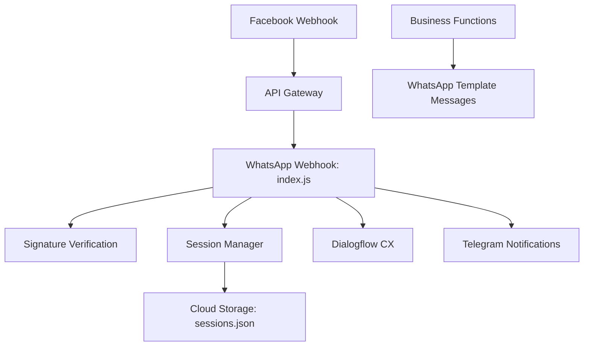

# Dialogflow WhatsApp Bot 🚀

[![Status][status-badge]][status-url]

**Production WhatsApp chatbot** deployed on **Google Cloud Run** with **API Gateway** for Facebook webhook routing. Processes user requests through **Dialogflow CX**, handles **4 business intents** (accidents, leads, technical support, complaints), and syncs **user sessions** across Google Cloud Storage.

## ✨ Features

| **Feature** | **Description** |
|-------------|-----------------|
| 🎯 **4 Business Intents** | Accidents (`newAccident`), Leads (`newLead`), Tech Support (`newTech`), Complaints (`newCom`) |
| 🤖 **Dialogflow CX** | Advanced conversational AI |
| 📱 **WhatsApp Business API** | Full webhook handling + signature verification |
| 🌐 **API Gateway** | Routes Facebook webhooks to Cloud Functions |
| ☁️ **Google Cloud** | Cloud Run → Refactored to Cloud Functions + Storage |
| 🔐 **Secure Sessions** | SHA256-based session IDs mapped to phone numbers |
| 📤 **Notifications** | Telegram alerts to main + test chats |

## 🏗️ Architecture



## 📁 Project Structure

```
Dialogflow_Whatsapp/
├── whatsapp/                 # Main webhook + AI logic
│   ├── index.js             # WhatsApp webhook handler (API Gateway target)
│   ├── agentCon.js          # Dialogflow CX integration  
│   ├── sessionManager.js    # Session ID management + Cloud Storage
│   ├── package.json
│   └── regal-cairn-...json  # Service account key
├── newaccident/             # Accident notification service
│   ├── index.js
│   └── package.json
├── newcom/                  # Complaint handling service  
│   ├── index.js
│   └── package.json
├── newlead/                 # Lead generation service
│   ├── index.js
│   └── package.json
├── newtech/                 # Technical support service
│   ├── index.js
│   └── package.json
└── README.md
```

## 🛠️ Tech Stack

| **Category** | **Technologies** |
|--------------|------------------|
| **Backend** | Node.js 20, Google Cloud Functions (from Cloud Run) |
| **API** | Google Cloud API Gateway (Facebook webhook routing) |
| **AI** | Dialogflow CX |
| **Messaging** | WhatsApp Business API v22.0 |
| **Storage** | Google Cloud Storage (sessions) |
| **Security** | HMAC-SHA256 webhook verification |
| **Notifications** | Telegram Bot API |

## 🔑 Security Features

- ✅ **API Gateway** routing + webhook signature verification (SHA256)
- ✅ **Secure Session IDs** (CryptoJS SHA256 + timestamp + random)
- ✅ **Environment Variables** (no secrets in code)
- ✅ **Cloud Storage Backups** (`.bak` files before overwrites)

## 🎯 Business Value

- **Lead Capture**: Collects name, company, surface area, period, location
- **Emergency Handling**: Instant accident notifications 
- **24/7 Support**: Technical help + complaints routing
- **Scalable**: Stateless services + persistent Cloud Storage

## 👨‍💻 Author

**Your Name**  
[LinkedIn](https://www.linkedin.com/in/danial-undefined-73b230385/) | [danial.ahmetbek@gmail.com](mailto:danial.ahmetbek@gmail.com)

***

<div align="center">
  <strong>Production WhatsApp automation via Google Cloud</strong>
</div>

[status-badge]: https://img.shields.io/badge/status-production-green.svg
[status-url]: https://github.com

***
